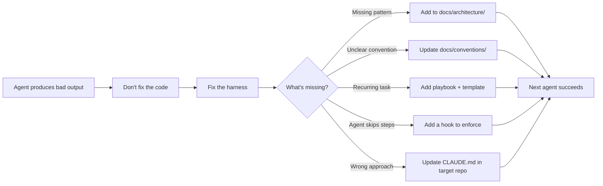

# Case

A harness for orchestrating AI agent work across WorkOS open source projects.

Inspired by [harness engineering](https://openai.com/index/harness-engineering/) — the discipline of designing environments that let AI agents operate reliably at scale. Humans steer. Agents execute. When agents struggle, fix the harness.

## How It Works

```mermaid
graph TD
    A[Engineer] -->|"/case 34" or "/case DX-1234"| B[/case skill]
    B --> C{Parse argument}
    C -->|GitHub issue| D[Fetch issue via gh CLI]
    C -->|Linear issue| E[Fetch issue via Linear MCP]
    C -->|No args| F[Load harness context]

    D --> G[Create task file in tasks/active/]
    E --> G
    G --> H[Activate enforcement: touch .case-active]
    H --> I[Route to playbook + architecture docs]
    I --> J[Create feature branch]
    J --> K[Execute the work]

    K --> L{Pre-PR Checklist}
    L -->|tests pass| L1[touch .case-tested]
    L -->|manual testing done| L2[touch .case-manual-tested]
    L -->|security audit if auth change| L3[Run security-auditor skill]

    L1 --> M[gh pr create]
    L2 --> M
    L3 --> M

    M -->|PreToolUse hook| N{Hooks gate}
    N -->|markers missing| O[BLOCKED - remediation instructions]
    O -->|agent fixes gaps| L
    N -->|all checks pass| P[PR opened]

    P -->|PostToolUse hook| Q[Cleanup: move task to done/, remove markers]
    Q --> R[Engineer reviews PR]
    R -->|agent struggled?| S[Fix the harness, not the code]
    S --> T[Update docs/playbooks/hooks in case/]
```

## Feedback Loop



## Quick Start

### Install the plugin

Register case as a Claude Code plugin marketplace and install:

```bash
claude plugin marketplace add /path/to/case
claude plugin install case
```

Restart Claude Code after installing. The `/case` skill will be available in all sessions.

To update after changes to the harness:
```bash
claude plugin marketplace update case
claude plugin uninstall case && claude plugin install case
```

### Use with an issue

From any target repo, hand an issue to case:

```bash
# GitHub issue
/case 34

# Linear issue
/case DX-1234
```

The agent fetches the issue, creates a task file, routes to the right playbook, does the work, and opens a PR. Hooks enforce the pre-PR checklist mechanically.

### Use interactively

```bash
/case fix a bug where session cookies aren't being set correctly
```

Loads harness context (landscape, conventions, playbooks) for the current task without the full issue workflow.

## Dispatching Tasks

Tasks are markdown files that agents execute. This is how you do fire-and-forget parallel work.

### 1. Pick a template

```bash
ls tasks/templates/
# cli-command.md          — add a CLI command
# authkit-framework.md    — new AuthKit framework integration
# bug-fix.md              — fix a bug in any repo
# cross-repo-update.md    — coordinated cross-repo change
```

### 2. Fill it in

```bash
cp tasks/templates/bug-fix.md tasks/active/authkit-nextjs-1-fix-cookie-bug.md
# Edit the file — fill in {placeholders}
```

### 3. Hand it to an agent

Use `--worktree` so the agent works in an isolated branch:

```bash
claude --worktree -p "Execute the task in tasks/active/authkit-nextjs-1-fix-cookie-bug.md"
```

### 4. Run multiple in parallel

Each agent gets its own worktree — no conflicts:

```bash
# Terminal 1
claude --worktree -p "Execute tasks/active/cli-1-add-widgets.md"

# Terminal 2
claude --worktree -p "Execute tasks/active/authkit-nextjs-1-fix-cookie-bug.md"

# Terminal 3
claude --worktree -p "Execute tasks/active/x-1-update-readme-badges.md"
```

### 5. Review PRs

Each agent opens a PR in the target repo. Review and merge as usual. Task files are automatically moved to `tasks/done/` by the post-PR hook.

## Enforcement

Case uses Claude Code hooks to mechanically enforce the pre-PR checklist. Hooks only activate during `/case` workflows (when `.case-active` marker exists).

| Hook | Trigger | What it enforces |
| --- | --- | --- |
| `pre-pr-check.sh` | `gh pr create` | Tests ran, manual testing done, verification notes in PR body, on feature branch |
| `pre-push-check.sh` | `git push` | Not pushing to main/master |
| `pre-commit-check.sh` | `git commit` | Conventional commit format |
| `post-pr-cleanup.sh` | `gh pr create` (after) | Moves task file to `done/`, cleans up markers |

When a hook blocks, it tells the agent exactly what's wrong and how to fix it:

```
CASE PRE-PR CHECK FAILED

[FAIL] Tests not verified — .case-tested marker missing
  FIX: Run tests (pnpm test, pnpm typecheck, pnpm build), then: touch .case-tested

[FAIL] Manual testing not done — .case-manual-tested marker missing
  FIX: Test the specific fix in the example app with playwright-cli, then: touch .case-manual-tested
```

## Verification Tools

Agents verify their work using:

- **Playwright CLI** — primary tool for front-end testing. Headless, scriptable, produces screenshots/video.
- **Screenshot uploads** — `scripts/upload-screenshot.sh` pushes images to a GitHub release and returns markdown for PR bodies.
- **Test credentials** — `~/.config/case/credentials` for sign-in flow testing.
- **Chrome DevTools MCP** — secondary, for interactive debugging only.
- **Security auditor** — runs automatically for auth/session changes via the pre-PR checklist.

## Verifying Repos

```bash
# Check conventions across all repos
bash scripts/check.sh

# Check a single repo
bash scripts/check.sh --repo cli

# Bootstrap a repo for agent work (install deps, run tests, build)
bash scripts/bootstrap.sh cli

# Run checks including test execution
bash scripts/check.sh --run-tests
```

## What's in the Harness

```
.claude-plugin/                     Plugin + marketplace manifests
skills/
  case/SKILL.md                     /case skill (router + workflow + checklist)
  security-auditor/SKILL.md         Security audit (auto-invoked, not user-facing)
hooks/
  hooks.json                        Hook configuration
  pre-pr-check.sh                   Block PR without test/verification markers
  pre-push-check.sh                 Block push to main/master
  pre-commit-check.sh               Enforce conventional commits
  post-pr-cleanup.sh                Move task files, clean markers

AGENTS.md                           Entry point for agents (project landscape)
CLAUDE.md                           How to improve case itself
projects.json                       Manifest of target repos

docs/
  architecture/                     Canonical patterns per repo type
  conventions/                      Shared rules (commits, testing, PRs, style)
  playbooks/                        Step-by-step guides for recurring operations
  golden-principles.md              Enforced invariants across all repos
  philosophy.md                     Design principles guiding case

tasks/
  active/                           Current tasks for agent execution
  done/                             Completed tasks
  templates/                        Fill-in-the-blank task templates

scripts/
  check.sh                          Convention enforcement across repos
  bootstrap.sh                      Per-repo readiness verification
  upload-screenshot.sh              Upload images to GitHub for PR descriptions
```

## Target Repos (v1)

| Repo | Path | Purpose |
| --- | --- | --- |
| cli | `../cli/main` | WorkOS CLI |
| skills | `../skills` | Claude Code skills plugin |
| authkit-session | `../authkit-session` | Framework-agnostic session management |
| authkit-tanstack-start | `../authkit-tanstack-start` | AuthKit TanStack Start SDK |
| authkit-nextjs | `../authkit-nextjs` | AuthKit Next.js SDK |

The manifest (`projects.json`) and all tooling are designed to scale to 25+ repos. Add a new repo by appending to `projects.json`.

## Philosophy

See [docs/philosophy.md](docs/philosophy.md) for the full set of principles. The highlights:

- **Humans steer. Agents execute.** Engineers define goals. Agents implement.
- **Never write code directly.** Only improve the harness. All code flows through agents.
- **When agents struggle, fix the harness.** The fix is never "try harder."
- **Enforce mechanically, not rhetorically.** Instructions decay over long sessions. Hooks don't.
- **The harness is the product. The code is the output.**

## Relationship to Skills Plugin

- **skills** (`../skills`) = WorkOS domain knowledge (what is SSO, how AuthKit works, API endpoints)
- **case** = orchestration layer (which repos exist, how to work across them, patterns, playbooks)

They're complementary. Case depends on skills for product knowledge.

## Adding a New Repo

1. Add entry to `projects.json` (follow the schema)
2. Ensure the repo has a `CLAUDE.md` with: commands, architecture, do/don't, PR checklist
3. Run `bash scripts/check.sh --repo <name>` to verify compliance
4. Add architecture doc to `docs/architecture/` if the repo introduces a new pattern
5. Update `AGENTS.md` project table
