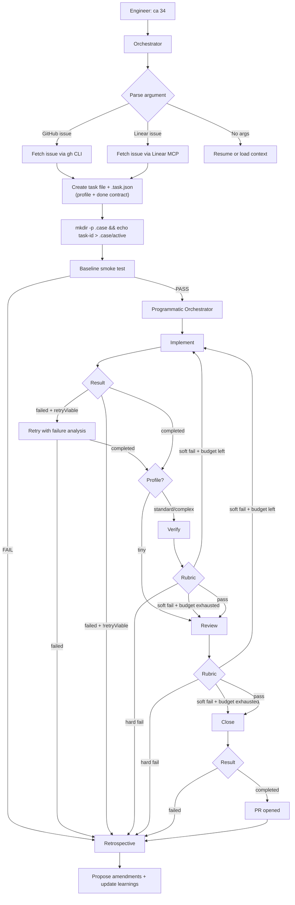
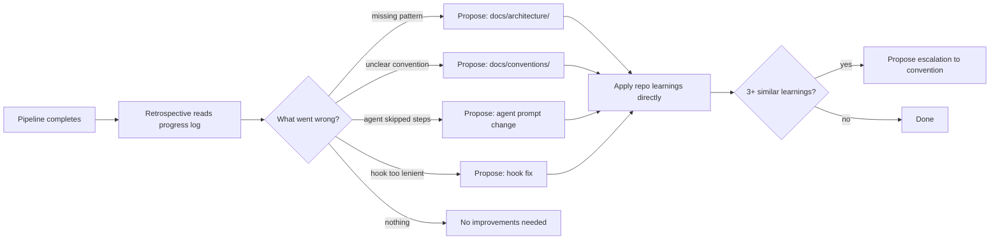

# Case


A harness for orchestrating AI agent work across WorkOS open source projects.

Inspired by [harness engineering](https://openai.com/index/harness-engineering/) and [effective harnesses for long-running agents](https://www.anthropic.com/engineering/effective-harnesses-for-long-running-agents) — the discipline of designing environments that let AI agents operate reliably at scale. Humans steer. Agents execute. When agents struggle, fix the harness.

## Quick Start

### Use with an issue

From any target repo directory:

```bash
ca 34             # GitHub issue
ca DX-1234        # Linear issue
```

The orchestrator fetches the issue, creates a task file (`.md` + `.task.json`) with a profile and optional done contract, runs a baseline smoke test, then spawns the pipeline. The default `standard` profile runs implementer → verifier → reviewer → closer → retrospective; `tiny` skips verification. Evaluator rubric failures can trigger automatic revision loops back to the implementer.

### Resume an interrupted run

Re-run the same command. The orchestrator detects the existing `.task.json` and resumes from the last completed agent phase.

```bash
ca 34             # resumes where it left off — doesn't recreate the task
```

### Interactive mode

Start a conversational session with the case orchestrator via the `ca` CLI:

```bash
ca --agent              # freeform — discuss, plan, explore before running anything
ca --agent 1234         # issue-directed — fetches the issue and presents context
```

The session identifies the current repo, checks for active tasks, and fetches issue context. You see the full briefing before anything executes:

```
Repo: cli (/path/to/cli)

Issue: Fix login bug
Users cannot log in when cookies are disabled

Ready to create a task and run the pipeline, or discuss first.
```

From there you can discuss approaches, ask questions, or tell the orchestrator to run the pipeline.

## How It Works

Case uses a **six-agent pipeline** where each agent has a focused context window and a single responsibility. This prevents context pollution — the root cause of agents forgetting to test, gaming evidence markers, or skipping checklist items.



Steps 0-3 (issue parsing, task creation, branch setup) are handled by the CLI orchestrator. Steps 4-9 (implement through retrospective) are handled by the **programmatic orchestrator** — a TypeScript `while`/`switch` loop that makes phase transitions deterministic rather than LLM-interpreted. The pipeline supports **revision loops** — when an evaluator (verifier/reviewer) finds fixable issues via rubric scoring, it automatically feeds structured feedback back to the implementer (up to 2 cycles by default).

All agents run as [Pi](https://shittycodingagent.ai/) sessions — the orchestrator as an interactive session with a TUI, sub-agents as batch sessions. Each agent role can use a different model/provider via `~/.config/case/config.json`.

### The Agents

| Agent             | Responsibility                                                                                          | Never does                     |
| ----------------- | ------------------------------------------------------------------------------------------------------- | ------------------------------ |
| **Orchestrator**  | Parse issue, create task (with profile + done contract), smoke test, dispatch agents                     | Write code, run Playwright     |
| **Implementer**   | Write fix, run unit tests, commit (with WIP checkpoints), read repo learnings, address revision feedback | Start example apps, create PRs |
| **Verifier**      | Test the specific fix with Playwright, create evidence, score rubric (pass/fail per category)            | Edit code, commit              |
| **Reviewer**      | Review diff against golden principles, score rubric (hard/soft categories), gate PR creation             | Edit code, commit, run tests   |
| **Closer**        | Create PR with thorough description, satisfy hooks, post review comments                                 | Edit code, run tests           |
| **Retrospective** | Analyze the run (incl. revision loops + metrics), propose improvements, apply per-repo learnings         | Edit target repo code          |

## Programmatic Orchestrator

The pipeline's flow control (Steps 4-9) runs as a TypeScript program rather than LLM-interpreted prose. The LLM still does the work _inside_ each phase (writing code, testing, reviewing), but the transitions _between_ phases are deterministic `if/else` branches.

| Concern                | Before (prose in SKILL.md)                             | After (TypeScript orchestrator)                       |
| ---------------------- | ------------------------------------------------------ | ----------------------------------------------------- |
| Phase transitions      | LLM reads a table and decides                          | `switch(currentPhase)` returns `nextPhase`            |
| Retry cap              | Doom-loop hook fires after 3 identical failures        | `maxRetries: 1` checked before spawning               |
| Revision loops         | Not supported — abort or ask human                     | Rubric soft-fails loop back to implementer (max 2)    |
| Pipeline profiles      | All tasks run the same phases                          | `tiny` / `standard` / `complex` skip or add phases    |
| Resume after interrupt | LLM reads status table, hopefully picks the right step | `determineEntryPhase(task)` returns the correct phase |
| Context per agent      | LLM decides what to include                            | `assemblePrompt()` gives each role only what it needs |
| Attended vs unattended | Not supported                                          | `--mode unattended` auto-aborts on failure            |

### Usage

Three ways to run Case:

```bash
# 1. Interactive mode — conversational TUI with Pi, can discuss before executing
ca --agent              # freeform planning / ideation session
ca --agent 1234         # start working on GitHub issue #1234
# In interactive mode, say "go" to quick-build, or "execute docs/ideation/foo/" for existing specs

# 2. Batch mode — detect repo, fetch issue, run full pipeline
ca 1234                 # GitHub issue
ca DX-1234              # Linear issue
ca                      # resume active task via .case/active marker

# 3. Task mode — run pipeline for an existing task file
ca --task tasks/active/cli-1-issue-53.task.json
ca --task tasks/active/cli-1-issue-53.task.json --mode unattended
ca --task tasks/active/cli-1-issue-53.task.json --dry-run
```

Override the model for all agents in a single run:

```bash
ca --model claude-opus-4-5 1234
ca --model gemini-2.5-pro --agent 1234
```

The `ca` CLI is the entry point for all Case operations.

### Architecture

```
src/
  index.ts                CLI entry point (run, create, serve, --agent)
  pipeline.ts             Core while/switch loop (Steps 4-9) with revision loops + profile skip
  server.ts               HTTP service (webhooks, task API, scanner dispatch)
  notify.ts               Attended (readline) vs unattended (auto-abort) notifier
  config.ts               Loads projects.json, resolves paths, builds PipelineConfig
  types.ts                TaskJson, AgentResult, PipelineConfig, Rubric, RevisionRequest, etc.
  agent/
    pi-runner.ts          Spawn Pi batch sessions per agent role
    orchestrator-session.ts  Interactive Pi session for --agent mode
    config.ts             Per-agent model config (~/.config/case/config.json)
    tool-sets.ts          Scoped Pi tools per agent role (read-only vs full write)
    prompt-loader.ts      Load agent .md prompts, strip frontmatter
    from-ideation.ts      Execute ideation contracts: load → phases → verify → review → close
    tools/
      define-tool.ts      Tool definition helper (schema + execute)
      pipeline-tool.ts    Pi tool: run the case pipeline from interactive session
      from-ideation-tool.ts Pi tool: execute ideation contracts through the pipeline
      issue-tool.ts       Pi tool: fetch issues from GitHub/Linear
      task-tool.ts        Pi tool: create task files (with profile + done contract)
      baseline-tool.ts    Pi tool: run bootstrap.sh
  entry/
    cli-orchestrator.ts   Steps 0-3: detect repo, fetch issue, create task, baseline
    issue-fetcher.ts      GitHub (gh CLI) and Linear (GraphQL) issue fetching
    github-webhook.ts     Parse + verify GitHub webhook events
    repo-detector.ts      Auto-detect target repo from cwd
    task-factory.ts       Create .md + .task.json pairs (done contract rendering)
    task-scanner.ts       Find existing tasks for re-entry
    scanners/             CI, stale-docs, and dependency scanners
  state/
    task-store.ts         Reads JSON directly, writes through task-status.sh
    transitions.ts        Deterministic re-entry from any task state (profile-aware)
  context/
    prefetch.ts           Parallel repo context gathering (session, learnings, commits)
    assembler.ts          Role-specific prompt assembly per agent (incl. revision context)
  phases/
    implement.ts          Spawn implementer + intelligent retry (max 1)
    verify.ts             Spawn verifier, score rubric, build revision request on fail
    review.ts             Spawn reviewer, rubric gate (hard → abort, soft → revision)
    revision.ts           Build structured RevisionRequest from failed rubric categories
    close.ts              Spawn closer, extract PR URL
    retrospective.ts      Spawn retrospective with metrics snapshot
  metrics/
    collector.ts          Per-run metrics collection (phases, rubrics, revision cycles)
    writer.ts             Write finalized RunMetrics to JSONL
  tracing/
    writer.ts             Per-run trace events (tool-level observability)
    types.ts              Trace event schema
    sanitize.ts           Sanitize sensitive data from traces
  versioning/
    prompt-tracker.ts     Track agent prompt versions across runs
  util/
    parse-agent-result.ts Extract AGENT_RESULT JSON from agent output
    run-script.ts         Safe execFile wrapper (no shell injection)
    logger.ts             Structured JSON-lines to stderr
    slugify.ts            URL-safe slug generation
    parse-jsonl.ts        Parse JSONL files
```

### Context Isolation

Each agent receives only what it needs — not everything:

- **Implementer**: task + issue + playbook + working memory + repo learnings + check fields + revision feedback (when looping)
- **Verifier**: task + repo path (deliberately minimal — fresh-context testing)
- **Reviewer**: task + repo path (reads golden principles itself)
- **Closer**: task + repo + verifier AGENT_RESULT + reviewer AGENT_RESULT
- **Retrospective**: task + all AGENT_RESULTs + metrics snapshot (rubrics, revision cycles, overrides)

## Model Configuration

Each agent role can use a different model and provider. Configure via `~/.config/case/config.json`:

```json
{
  "$schema": "https://raw.githubusercontent.com/workos/case/main/config.schema.json",
  "models": {
    "default": { "provider": "anthropic", "model": "claude-sonnet-4-20250514" },
    "reviewer": { "provider": "google", "model": "gemini-2.5-pro" },
    "retrospective": { "provider": "anthropic", "model": "claude-haiku-4-5-20251001" },
    "verifier": null
  }
}
```

- **`default`** — used when a role has no specific config
- **Role-specific** — set provider + model per agent (implementer, verifier, reviewer, closer, retrospective, orchestrator)
- **`null`** — explicitly means "use default"
- **Missing file** — all agents use Claude Sonnet (hardcoded default)
- **`--model` flag** — overrides config for all agents in a single run

Priority chain: `--model` CLI flag > explicit `spawnAgent` options > config file > hardcoded defaults.

Pi's `ModelRegistry` supports 20+ providers (Anthropic, Google, OpenAI, local models, etc.) — any model ID that Pi recognizes works here.

## Self-Improvement

After every pipeline run — success or failure — the retrospective agent analyzes what happened and **proposes improvements** to the harness (staged in `docs/proposed-amendments/` for human review). It also applies per-repo learnings directly so knowledge compounds across runs:



## Task Tracking

Tasks use a **hybrid format**: human-readable Markdown + a JSON companion for machine-touched fields. Task templates include a **mission summary block** at the top — a one-line "what + why", target repo, and primary acceptance criterion — so agents can orient quickly without reading the full task.

Each task has a **profile** (`tiny | standard | complex`) that determines which pipeline phases run. Non-trivial tasks can include a **done contract** — verification scenarios, non-goals, edge cases, and evidence expectations — so implementer and verifier share the same definition of "done".

```
tasks/active/authkit-nextjs-1-issue-53.md         # human-readable
tasks/active/authkit-nextjs-1-issue-53.task.json   # machine-touched
```

The JSON companion tracks status, agent phases, evidence flags, and PR metadata. Status transitions are enforced by `scripts/task-status.sh`:

```
active → implementing → verifying → reviewing → closing → pr-opened → merged
```

Each agent appends to the task file's `## Progress Log` — creating a running record of what was done, by whom, and when.

### Dispatching tasks manually

```bash
# Pick a template
ls tasks/templates/

# Fill it in
cp tasks/templates/bug-fix.md tasks/active/authkit-nextjs-1-fix-cookie-bug.md
# Edit the file — fill in {placeholders}

# Hand it to an agent (use --worktree for isolation)
ca --task tasks/active/authkit-nextjs-1-fix-cookie-bug.task.json
```

## Enforcement

The pipeline enforces the pre-PR checklist through the closer agent's pre-flight checks and the programmatic orchestrator's phase gates. Evidence markers track that work was actually done:

- `mark-tested.sh` — requires piped test output, records SHA-256 hash. Supports structured JSON reporter input via `parse-test-output.sh`. Rejects bare `touch`.
- `mark-manual-tested.sh` — requires recent Playwright screenshots. Rejects without evidence.
- `mark-reviewed.sh` — requires `--critical 0` (no unresolved critical findings from reviewer). Rejects if critical findings exist.

The closer agent verifies all markers exist before attempting `gh pr create`. The pipeline limits retries to prevent doom loops. All marker scripts also update the task JSON as a side effect.

## Verification Tools

Agents verify their work using:

- **Playwright CLI** — primary tool for front-end testing. Headless, scriptable, produces screenshots/video.
- **Screenshot uploads** — `scripts/upload-screenshot.sh` pushes images to a GitHub release and returns markdown for PR bodies. Auto-converts video to animated GIF for inline GitHub rendering.
- **Structured test output** — `scripts/parse-test-output.sh` parses vitest JSON reporter output into machine-readable evidence for `.case/<task-slug>/tested` markers (pass/fail counts, duration, per-file breakdown).
- **Session context** — `scripts/session-start.sh` gathers structured JSON context (branch, commits, task status, evidence markers) at the start of every agent's context window.
- **Reviewer agent** — reviews the diff against golden principles and conventions. Critical findings block PR creation; warnings and info are posted as PR comments.
- **Test credentials** — `~/.config/case/credentials` for sign-in flow testing.
- **Chrome DevTools MCP** — secondary, for interactive debugging only.


## Verifying Repos

```bash
# Check conventions across all repos
bash scripts/check.sh

# Check a single repo
bash scripts/check.sh --repo cli

# Bootstrap a repo for agent work (install deps, run tests, build)
bash scripts/bootstrap.sh cli
```

## What's in the Harness

```
agents/
  implementer.md                    Subagent: code + unit tests (WIP checkpoints, reads learnings)
  verifier.md                       Subagent: Playwright testing + evidence + rubric scoring
  reviewer.md                       Subagent: diff review + rubric scoring (hard/soft categories)
  closer.md                         Subagent: PR creation + hook satisfaction + review comments
  retrospective.md                  Subagent: analyze run + revision loops + maintain learnings
src/                                Programmatic orchestrator (TypeScript)
  index.ts                          CLI entry point (--agent, --model, --task)
  pipeline.ts                       Core while/switch loop (Steps 4-9) + revision loops
  server.ts                         HTTP service (webhooks, task API, scanners)
  agent/                            Pi-based agent infrastructure
    pi-runner.ts                    Spawn Pi batch sessions per role
    orchestrator-session.ts         Interactive Pi session (--agent mode)
    config.ts                       Per-agent model config
    tools/                          Orchestrator tools (pipeline, issue, task, baseline)
  entry/                            CLI orchestrator (Steps 0-3) + webhook + scanners
  phases/                           One module per pipeline phase + revision
  context/                          Role-specific prompt assembly (incl. revision context)
  state/                            Task store + re-entry logic (profile-aware)
  metrics/                          Per-run metrics collection + JSONL writer
  tracing/                          Per-run trace events for observability
  versioning/                       Prompt version tracking across runs
  util/                             Parser, script runner, logger, slugify
config.schema.json                  JSON Schema for ~/.config/case/config.json

AGENTS.md                           Entry point for agents (project landscape)
CLAUDE.md                           How to improve case itself
projects.json                       Manifest of target repos

docs/
  architecture/                     Canonical patterns per repo type
  conventions/                      Shared rules (commits, testing, PRs, style)
  conventions/entropy-management.md Entropy scanning + /loop integration
  conventions/claude-md-ordering.md CLAUDE.md section ordering for cache efficiency
  playbooks/                        Step-by-step guides for recurring operations
  golden-principles.md              Enforced invariants across all repos
  philosophy.md                     Design principles guiding case (incl. context engineering)
  learnings/                        Per-repo tactical knowledge from retrospective
  ideation/                         Ideation artifacts (contracts, specs)

tasks/
  active/                           Current tasks (.md + .task.json pairs)
  done/                             Completed tasks
  templates/                        Task templates (with mission summary blocks)
  task.schema.json                  JSON Schema for .task.json companion files

scripts/
  check.sh                          Convention enforcement across repos
  bootstrap.sh                      Per-repo readiness verification
  task-status.sh                    Read/update task JSON with transition validation
  analyze-failure.sh                Analyze agent failures for retry decisions
  snapshot-agent.sh                 Snapshot agent state for debugging
  mark-tested.sh                    Evidence-based test marker (rejects bare touch)
  mark-manual-tested.sh             Evidence-based manual test marker
  mark-reviewed.sh                  Review evidence marker (requires critical: 0)
  upload-screenshot.sh              Upload images to GitHub for PR descriptions
  session-start.sh                  Session context for all agents (structured JSON)
  parse-test-output.sh              Parse vitest JSON reporter into structured evidence
  entropy-scan.sh                   Convention drift scanner across repos
```

## Target Repos (v1)

| Repo                   | Path                        | Purpose                               |
| ---------------------- | --------------------------- | ------------------------------------- |
| cli                    | `../cli/main`               | WorkOS CLI                            |
| skills                 | `../skills`                 | WorkOS integration skills             |
| authkit-session        | `../authkit-session`        | Framework-agnostic session management |
| authkit-tanstack-start | `../authkit-tanstack-start` | AuthKit TanStack Start SDK            |
| authkit-nextjs         | `../authkit-nextjs`         | AuthKit Next.js SDK                   |
| workos-node            | `../workos-node`            | WorkOS Node.js SDK                    |

The manifest (`projects.json`) and all tooling are designed to scale to 25+ repos. Add a new repo by appending to `projects.json`.

## Philosophy

See [docs/philosophy.md](docs/philosophy.md) for the full set of principles. The highlights:

- **Humans steer. Agents execute.** Engineers define goals. Agents implement.
- **Never write code directly.** Only improve the harness. All code flows through agents.
- **When agents struggle, fix the harness.** The fix is never "try harder."
- **Enforce mechanically, not rhetorically.** Instructions decay over long sessions. Hooks don't.
- **Every run improves the harness.** The retrospective agent applies fixes directly and maintains per-repo learnings after every pipeline run.
- **The harness is the product. The code is the output.**
- **Context engineering matters.** Structure documents for LLM cache efficiency (stable content first, volatile last). Break doom loops mechanically. Compound knowledge across runs via learnings files.

## Entropy Management

Convention drift is inevitable when agents replicate existing patterns — including suboptimal ones. Case includes continuous scanning to catch drift early.

```bash
# One-time scan across all repos
bash scripts/entropy-scan.sh

# Scan a specific repo
bash scripts/entropy-scan.sh --repo cli
```

For ongoing monitoring, run entropy scans periodically:

```bash
bash scripts/entropy-scan.sh
```

See [docs/conventions/entropy-management.md](docs/conventions/entropy-management.md) for recommended intervals and details on what gets checked.

## Relationship to Skills Plugin

- **skills** (`../skills`) = WorkOS domain knowledge (what is SSO, how AuthKit works, API endpoints)
- **case** = orchestration layer (which repos exist, how to work across them, patterns, playbooks)

They're complementary. Case depends on skills for product knowledge.

## Adding a New Repo

1. Add entry to `projects.json` (follow the schema)
2. Ensure the repo has a `CLAUDE.md` with: commands, architecture, do/don't, PR checklist
3. Run `bash scripts/check.sh --repo <name>` to verify compliance
4. Add architecture doc to `docs/architecture/` if the repo introduces a new pattern
5. Update `AGENTS.md` project table
