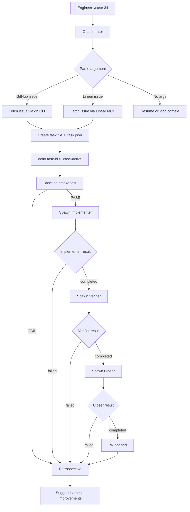
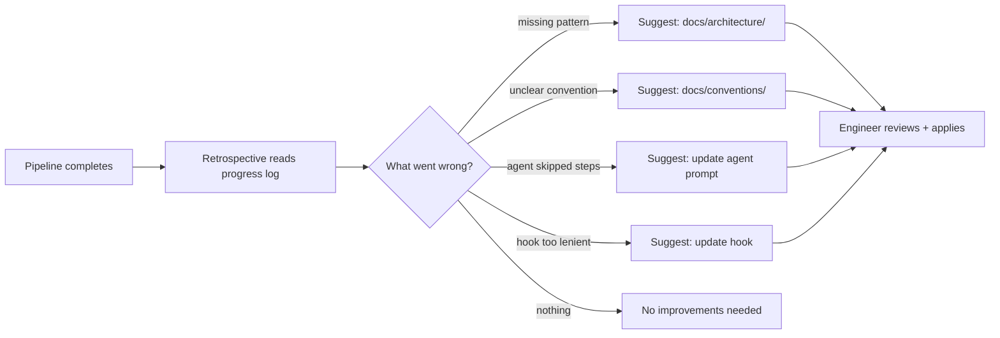

# Case


A harness for orchestrating AI agent work across WorkOS open source projects.

Inspired by [harness engineering](https://openai.com/index/harness-engineering/) and [effective harnesses for long-running agents](https://www.anthropic.com/engineering/effective-harnesses-for-long-running-agents) — the discipline of designing environments that let AI agents operate reliably at scale. Humans steer. Agents execute. When agents struggle, fix the harness.

## How It Works

Case uses a **five-agent pipeline** where each agent has a focused context window and a single responsibility. This prevents context pollution — the root cause of agents forgetting to test, gaming evidence markers, or skipping checklist items.



### The Five Agents

| Agent | Responsibility | Never does |
|---|---|---|
| **Orchestrator** | Parse issue, create task, smoke test, dispatch agents | Write code, run Playwright |
| **Implementer** | Write fix, run unit tests, commit | Start example apps, create PRs |
| **Verifier** | Test the specific fix with Playwright, create evidence | Edit code, commit |
| **Closer** | Create PR with thorough description, satisfy hooks | Edit code, run tests |
| **Retrospective** | Analyze the run, suggest harness improvements | Edit any files |

## Self-Improvement

After every pipeline run — success or failure — the retrospective agent analyzes what happened and suggests improvements to the harness itself:



## Quick Start

### Install the plugin

```bash
claude plugin marketplace add /path/to/case
claude plugin install case
```

Restart Claude Code after installing. The `/case` skill will be available in all sessions.

To update after changes:
```bash
claude plugin uninstall case && claude plugin marketplace update && claude plugin install case
```

### Use with an issue

From any target repo:

```bash
# GitHub issue
/case 34

# Linear issue
/case DX-1234
```

The orchestrator fetches the issue, creates a task file (`.md` + `.task.json`), runs a baseline smoke test, then spawns implementer → verifier → closer → retrospective. Hooks enforce evidence mechanically.

### Resume an interrupted run

If a `/case` run is interrupted, re-run the same command. The orchestrator detects the existing `.task.json` and resumes from the last completed agent phase.

```bash
# Resumes where it left off — doesn't recreate the task
/case 34
```

### Use interactively

```bash
/case fix a bug where session cookies aren't being set correctly
```

Loads harness context (landscape, conventions, playbooks) for the current task without the full pipeline.

## Task Tracking

Tasks use a **hybrid format**: human-readable Markdown + a JSON companion for machine-touched fields.

```
tasks/active/authkit-nextjs-1-issue-53.md         # human-readable
tasks/active/authkit-nextjs-1-issue-53.task.json   # machine-touched
```

The JSON companion tracks status, agent phases, evidence flags, and PR metadata. Status transitions are enforced by `scripts/task-status.sh`:

```
active → implementing → verifying → closing → pr-opened → merged
```

Each agent appends to the task file's `## Progress Log` — creating a running record of what was done, by whom, and when.

### Dispatching tasks manually

```bash
# Pick a template
ls tasks/templates/

# Fill it in
cp tasks/templates/bug-fix.md tasks/active/authkit-nextjs-1-fix-cookie-bug.md
# Edit the file — fill in {placeholders}

# Hand it to an agent (use --worktree for isolation)
claude --worktree -p "Execute the task in tasks/active/authkit-nextjs-1-fix-cookie-bug.md"
```

## Enforcement

Case uses Claude Code hooks to mechanically enforce the pre-PR checklist. Hooks only activate during `/case` workflows (when `.case-active` marker exists).

| Hook | Trigger | What it enforces |
| --- | --- | --- |
| `pre-pr-check.sh` | `gh pr create` | Evidence-based test markers (not bare `touch`), manual testing evidence if src/ changed, verification notes in PR body, feature branch |
| `pre-push-check.sh` | `git push` | Not pushing to main/master |
| `pre-commit-check.sh` | `git commit` | Conventional commit format |
| `post-pr-cleanup.sh` | `gh pr create` (after) | Updates task JSON status to `pr-opened`, cleans up markers |

Evidence markers are created by scripts that verify work was actually done:
- `mark-tested.sh` — requires piped test output, records SHA-256 hash. Rejects bare `touch`.
- `mark-manual-tested.sh` — requires recent Playwright screenshots. Rejects without evidence.

Both scripts also update the task JSON as a side effect.

## Verification Tools

Agents verify their work using:

- **Playwright CLI** — primary tool for front-end testing. Headless, scriptable, produces screenshots/video.
- **Screenshot uploads** — `scripts/upload-screenshot.sh` pushes images to a GitHub release and returns markdown for PR bodies.
- **Test credentials** — `~/.config/case/credentials` for sign-in flow testing.
- **Chrome DevTools MCP** — secondary, for interactive debugging only.
- **Security auditor** — runs automatically for auth/session changes via the pre-PR checklist.

## Verifying Repos

```bash
# Check conventions across all repos
bash scripts/check.sh

# Check a single repo
bash scripts/check.sh --repo cli

# Bootstrap a repo for agent work (install deps, run tests, build)
bash scripts/bootstrap.sh cli
```

## What's in the Harness

```
.claude-plugin/                     Plugin + marketplace manifests
skills/
  case/SKILL.md                     /case skill (orchestrator + pipeline)
  security-auditor/SKILL.md         Security audit (auto-invoked, not user-facing)
agents/
  implementer.md                    Subagent: code + unit tests
  verifier.md                       Subagent: Playwright testing + evidence
  closer.md                         Subagent: PR creation + hook satisfaction
  retrospective.md                  Subagent: post-run harness improvement
hooks/
  hooks.json                        Hook configuration
  pre-pr-check.sh                   Block PR without evidence markers
  pre-push-check.sh                 Block push to main/master
  pre-commit-check.sh               Enforce conventional commits
  post-pr-cleanup.sh                Update task JSON status, clean markers

AGENTS.md                           Entry point for agents (project landscape)
CLAUDE.md                           How to improve case itself
projects.json                       Manifest of target repos

docs/
  architecture/                     Canonical patterns per repo type
  conventions/                      Shared rules (commits, testing, PRs, style)
  playbooks/                        Step-by-step guides for recurring operations
  golden-principles.md              Enforced invariants across all repos
  philosophy.md                     Design principles guiding case
  ideation/                         Ideation artifacts (contracts, specs)

tasks/
  active/                           Current tasks (.md + .task.json pairs)
  done/                             Completed tasks
  templates/                        Fill-in-the-blank task templates
  task.schema.json                  JSON Schema for .task.json companion files

scripts/
  check.sh                          Convention enforcement across repos
  bootstrap.sh                      Per-repo readiness verification
  task-status.sh                    Read/update task JSON with transition validation
  mark-tested.sh                    Evidence-based test marker (rejects bare touch)
  mark-manual-tested.sh             Evidence-based manual test marker
  upload-screenshot.sh              Upload images to GitHub for PR descriptions
```

## Target Repos (v1)

| Repo | Path | Purpose |
| --- | --- | --- |
| cli | `../cli/main` | WorkOS CLI |
| skills | `../skills` | Claude Code skills plugin |
| authkit-session | `../authkit-session` | Framework-agnostic session management |
| authkit-tanstack-start | `../authkit-tanstack-start` | AuthKit TanStack Start SDK |
| authkit-nextjs | `../authkit-nextjs` | AuthKit Next.js SDK |

The manifest (`projects.json`) and all tooling are designed to scale to 25+ repos. Add a new repo by appending to `projects.json`.

## Philosophy

See [docs/philosophy.md](docs/philosophy.md) for the full set of principles. The highlights:

- **Humans steer. Agents execute.** Engineers define goals. Agents implement.
- **Never write code directly.** Only improve the harness. All code flows through agents.
- **When agents struggle, fix the harness.** The fix is never "try harder."
- **Enforce mechanically, not rhetorically.** Instructions decay over long sessions. Hooks don't.
- **Every run improves the harness.** The retrospective agent surfaces what to fix after every pipeline run.
- **The harness is the product. The code is the output.**

## Relationship to Skills Plugin

- **skills** (`../skills`) = WorkOS domain knowledge (what is SSO, how AuthKit works, API endpoints)
- **case** = orchestration layer (which repos exist, how to work across them, patterns, playbooks)

They're complementary. Case depends on skills for product knowledge.

## Adding a New Repo

1. Add entry to `projects.json` (follow the schema)
2. Ensure the repo has a `CLAUDE.md` with: commands, architecture, do/don't, PR checklist
3. Run `bash scripts/check.sh --repo <name>` to verify compliance
4. Add architecture doc to `docs/architecture/` if the repo introduces a new pattern
5. Update `AGENTS.md` project table
